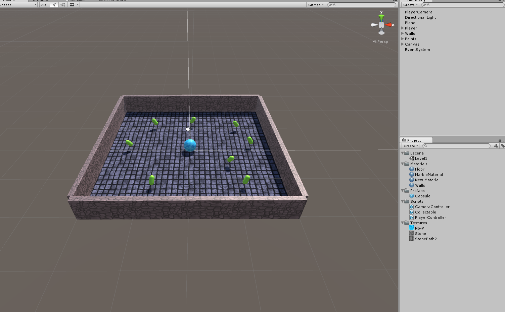
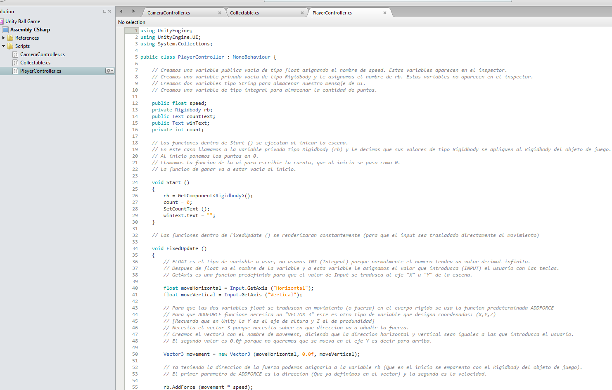
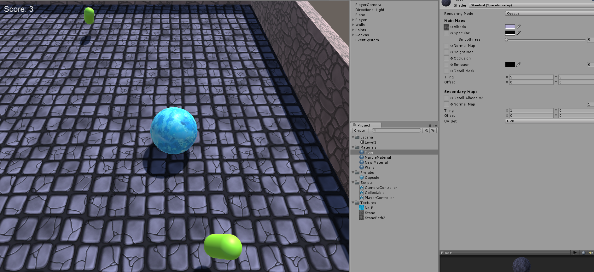

<br />
<div align="center">
	<h3 align="center">Ball Game with Unity</h3>
	<p align="center">
    	One of my first games done with Unity while I was learning C# in Visual Studio
  	</p>
</div>

## About

Use `wasd` keys to move, collect all the green pills to win!

## Installation

1. Download and install unity version 5.3.2f1
2. Clone the repo
   ```sh
   git clone https://github.com/DarioArzaba/UnityBallGame.git
   cd UnityBallGame
   ```
3. You can open the project from Unity Hub or simply run `dist.ext` in windowed mode.

## Usage

First Level Design | Player Controller Code | Testing the level
:-------------------------:|:-------------------------: |:-------------------------:
  |  | 

## Roadmap

- [x] Basic ball movement
- [ ] Create marble blast ultra clone
    - [ ] Add more levels with different geometry
    - [ ] Translate to a modern version of Unity

## License

Distributed under the [MIT License](https://mit-license.org/).

## Contact

Dario Arzaba - dario.arzaba@gmail.com 